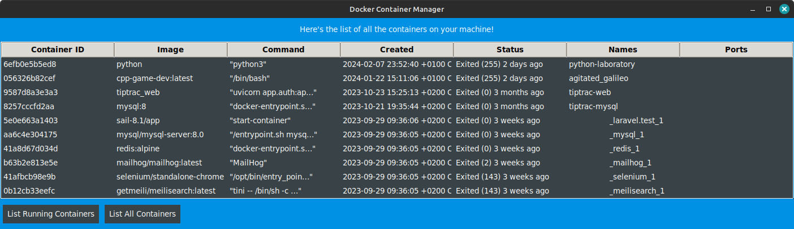

<p align="center">
    
    <h1 align="center">Gondolier</h1>
    <p align="center">A simple alternative to Docker desktop (Work in Progress)</p>
</p>



> This is just a simple project that I am working on. It is not ready for production. I am just sharing it with you to get some feedback. Also, the interface will be heavily modified in the near future.

# Table of contents

- [Table of contents](#table-of-contents)
- [What is Gondolier?](#what-is-gondolier)
- [Why Gondolier + my experience with Docker desktop?](#why-gondolier--my-experience-with-docker-desktop)
- [Supported platforms](#supported-platforms)
- [How to use Gondolier?](#how-to-use-gondolier)
- [Requirements](#requirements)

# What is Gondolier?

Gondolier is an alternative to Docker desktop. It is a simple tool that allows you to manage your Docker images and containers. It is not a replacement for Docker's CLI.

# Why Gondolier + my experience with Docker desktop?

Docker desktop is a great tool, but it has some limitations as well as some bugs. Also it is not open source. Gondolier is a simple alternative that works on Linux and Mac.

Also, here is **my experience** with Docker desktop:\
When I installed Docker desktop on my Linux machine, I was not able to see or use all the images and containers that I "previously" created using Docker's CLI. While using Docker desktop, I could only create and see the images and containers that I created using Docker desktop.
After I uninstalled the Docker desktop, all was fine again. I am not sure if this is a bug or a feature, but it is not acceptable for me. I need to see and use all my images and containers, no matter how I created them.

# Supported platforms

- Linux
- Mac (not tested yet, but it should work)
- Windows WSL (not tested yet)

# How to use Gondolier?

Just download the Gondolier repo and run the following command:

```python
python3 gondolier.py
```

# Requirements

- Python3
- TKinter

---

An icon is taken from freepik.com
